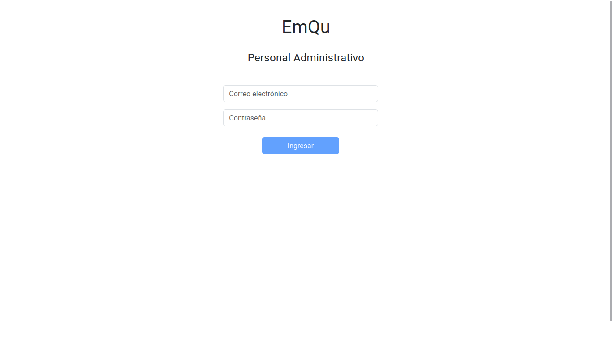
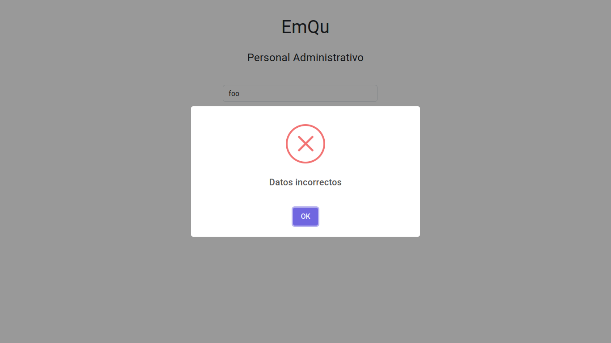
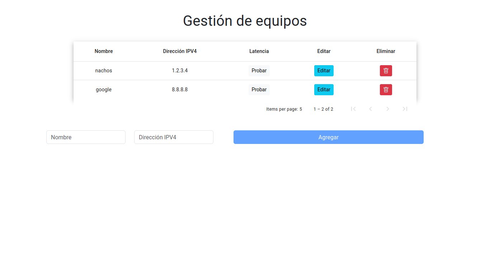
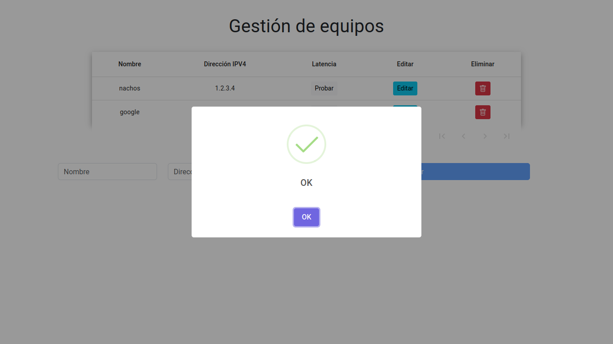
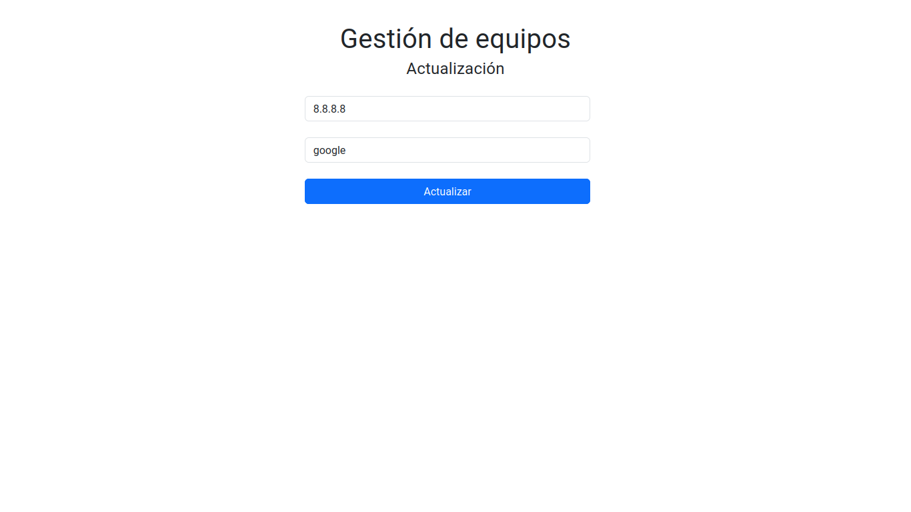
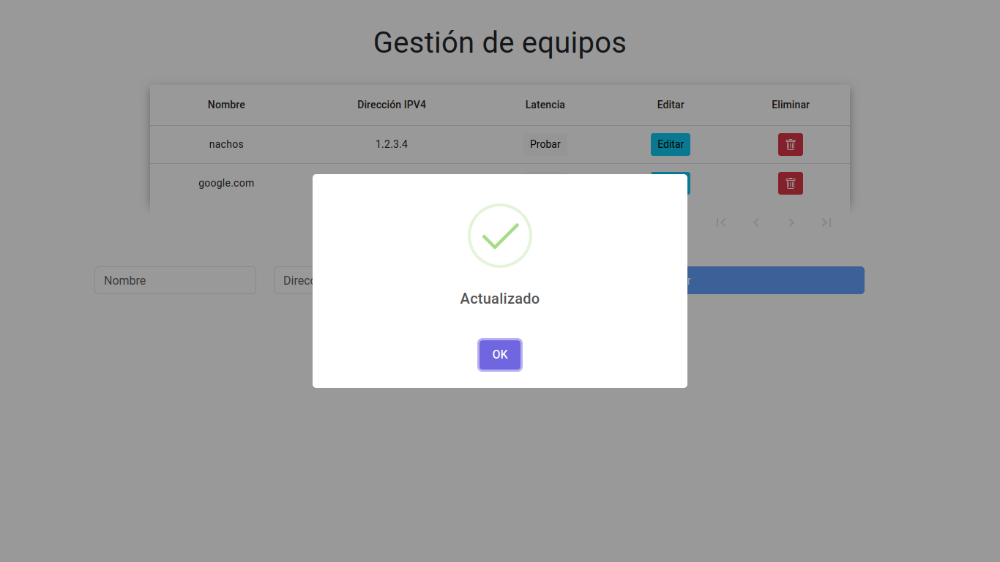
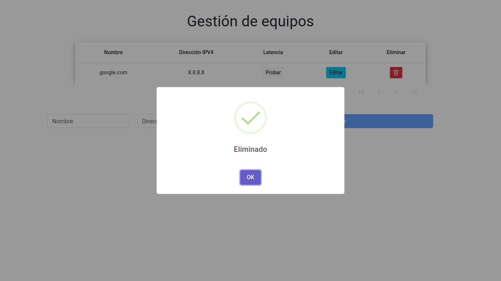
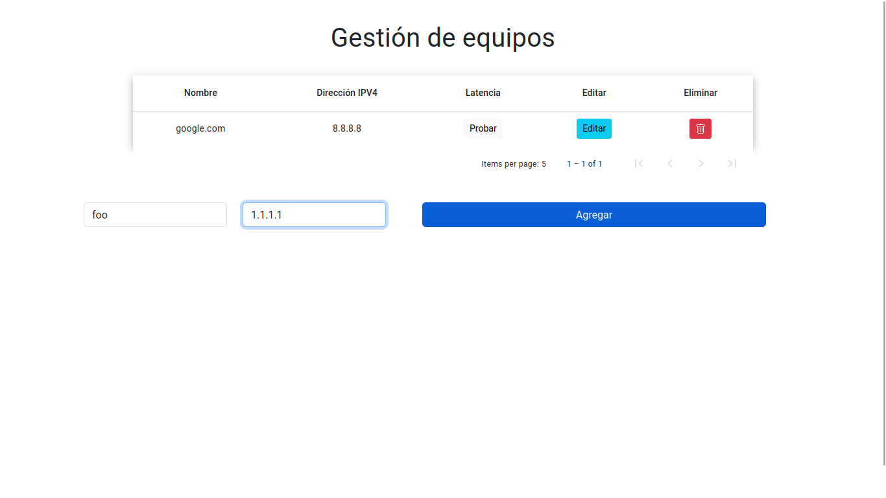
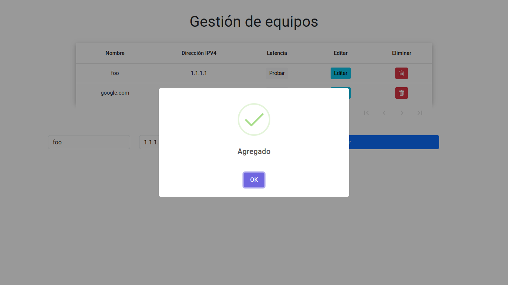
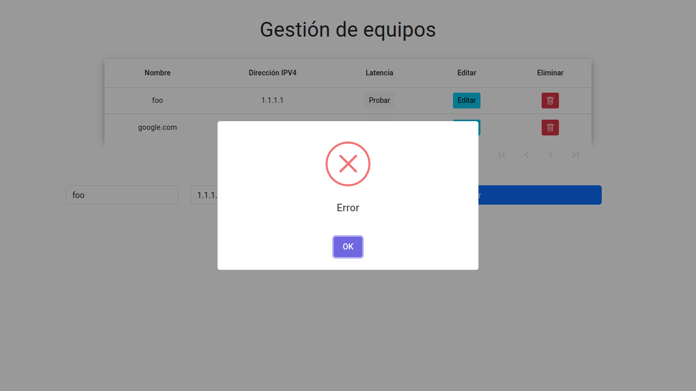

Autora: Kethrim Guadalupe Trad Mateos

## Detalles
El sistema de gestión de equipos no fue completado.
Aunque hay un login, no hay un logout ni una manera de registrarse; aunque ésta última ya está implementada en el banckend o modelo.
La seguridad es casi nula y las validaciones en los formularios no fueron agregadas, aunque pueden serlo fácilmente con expresiones regulares para las direcciones ip y los correos.
Usé el patrón MVC con Angular y Flask, como se pedía en el requerimientos.
La información a guardar por cada prueba de latencia es muy poca, pero ésta es fácil de modificar para agregar más datos en caso de usarlos para estadísticas. No se generaron estadísticas. 
El proyecto fue desarrollado en linux.

## Pruebas
Pruebas del funcionamiento del sistema:

El login o inicio de sesión administrativo se ve así, 
    
Si los datos no son correctos, se muestra el siguiente error,
    
Pero si son correctos pasamos al módulo de gestión de equipos,
    
Donde, al probar la latencia de la ip 8.8.8.8 obtenemos la siguiente pantalla,
    

Si queremos modificar, presionamos el botón de editar y vemos la siguiente pantalla,
    
Donde yo cambié el nombre de la ip de google,
    ,
Y al presionar actualizar se ve la siguiente pantalla,
    
Luego, al eliminar exitosamente un equipo, vemos la siguiente pantalla
    

Para agregar un equipo, usamos el formulario de abajo, de la siguiente manera
    
Y podemos ver si éste fue agregado con éxito,
    
O si hubo un error al agregarlo
    

## Dependencias

Dentro de las dependencias usadas, están
    Flask                             2.0.1
    SQLAlchemy                        1.4.21
    Flask-WTF                         1.0.1
    PyMySQL                           0.8.0
    Flask-Cors                        4.0.0
    Flask-MySQL                       1.5.2
    Flask-SQLAlchemy                  2.5.1
    marshmallow                       3.12.2
    marshmallow-sqlalchemy            0.26.1
    mysql                             0.0.3
    mysqlclient                       2.0.3
    Pillow                            8.4.0
    webencodings                      0.5.1
    Werkzeug                          2.0.1
    WTForms                           3.0.0

    Angular CLI: 16.0.6
    Node: 16.14.2
    Package Manager: npm 8.5.0

## Instalación base de datos
Se debe crear un usuario y una contraseña para éste proyecto, mediante los comandos en linux

    mysql -u root -p
    create user pruebatest;
    alter user pruebatest IDENTIFIED WITH mysql_native_password BY "pruebatest";
    grant all on *.* to pruebatest;
    \q
Luego, situarse en la carpeta coonexionbd y ejecutar

    mysql -u pruebatest -p < database/DDL.sql

## Ejecución backend

Situarse en la carpeta conexionbd y ejeuctar

    export FLASK_APP=main.py
    flask run

## Ejecución frontend
Situarse en la carpeta sistema-latencia y ejecutar

    npm install
    ng s

Ambos servidores deben estar corriendo para que el proyecto se ejecute correctamente
